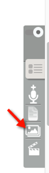

# To add items (Photographs, Videos, Audio)

## Creating a Community (or select an existing one)
1. To add Community navigate to `+ Community` on homepage or click on ‘Dashboard’ on homepage and click on `Communities`-> `Create Community`.
2. At the bottom of the page click on `Comment Settings` to set commenting option for authenticated users. (Select open or close). (By default it is open).
3. **To add thumbnail images/media for community name** - While in the `Add/Edit Community`, click on SCALD (the grey button on centre right side of the screen). Select type of media e.g. images button (3rd option vertically); previously uploaded images will show here and can be used for the Community’s page content or you can add new images (`SCALD Media Manager`).

